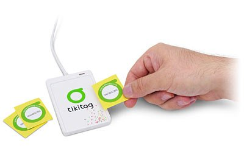

# Tikitag ALE Reader

This OSGi bundle generates ALE events from NFC tags data read from a Tikitag reader.

It is based on the Tikitag client

The patched version of the Tikitag client (in ./src/java/com/tikitag/client) calls the remotereader.http thru the HttpAdapterProxy class in order to convert Tikitag tagEvent in ALE events.

> Remark : the tikitag reader is an ACR 122 USB (CCID compliant)
> The API is described in this [manual](./doc/ACS_API_ACR122.pdf). The original doc was in http://www.nfc-reader.com/> NFC-smart-card-reader/ACR122-API-Manual/API_ACR122.pdf 

References:
* https://www.acr122.com/
* https://www.acs.com.hk/download-manual/419/API-ACR122U-2.04.pdf
* https://www.acs.com.hk/download-manual/418/TSP-ACR122U-3.06.pdf
* https://www.nfc-tools.org/index.php?title=ACR122
* http://code.google.com/p/tikitagdev (licence Apache Software Licence v2.0)
* http://tikitagdev.googlecode.com/files/tikitag-client-1.0-SNAPSHOT-jar-with-dependencies.jar
* https://en.wikipedia.org/wiki/Touchatag

